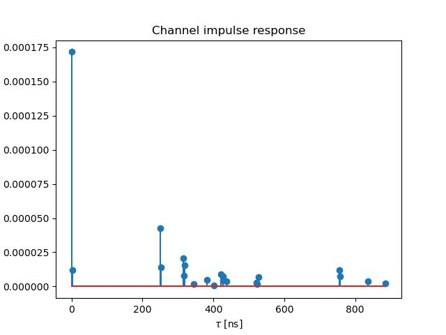

# Introduction to Sionna RT

This folder documents my understanding and notes from working through the **Introduction to Sionna RT** tutorial.  
Instead of just code, the focus here is on the **concepts and theory** behind ray tracing for wireless channels.

---

## Ray Tracing for Wireless Channels
- **Ray tracing** is used to generate environment-specific, physically accurate channel realizations.
- It simulates how electromagnetic (EM) waves propagate in a given scene:
  - Line-of-Sight (LoS) paths
  - Reflections
  - Refractions
  - Scattering
- Provides **channel impulse responses (CIRs)** and **frequency responses (CFRs)** that depend on the actual geometry and materials of the environment.

---

## What is Sionna RT?
- An **open-source, differentiable, hardware-accelerated ray tracer** for radio propagation modeling.
- Built on top of:
  - **Mitsuba 3** → rendering system for light transport.
  - **Dr.Jit** → just-in-time compiler with automatic gradient computation.
- Differentiability enables **optimization**:
  - Gradients can be computed w.r.t. material properties, antenna patterns, object positions, etc.
- Scenes are described in **Mitsuba XML format**, but can also be created in **Blender** (with OpenStreetMap + Blender-OSM).

---

## Scenes and Objects
- A scene is made of **SceneObjects** (e.g., buildings, streets, floors).
- Each object has:
  - **Position, orientation, scaling** → geometry in 3D space.
  - **Velocity vector** → important for **Doppler shifts**.
  - **RadioMaterial** → determines interaction with EM waves (reflection, absorption, scattering).
- Materials (like concrete, glass, metal) are frequency-dependent.  
  Example: conductivity of concrete increases with carrier frequency.

---

## Propagation Paths
- Defined between **Transmitters (TX)** and **Receivers (RX)** placed in the scene.
- Antenna arrays can be planar, dipole, or use standardized patterns (e.g., 3GPP TR 38.901).
- The **PathSolver** computes all possible paths:
  - Controlled by `max_depth` (LoS only, or include higher-order reflections/refractions).
  - Stochastic for diffuse scattering (depends on random seeds).
- Each path has:
  - **Delay (τ)**
  - **Complex gain (a)**
  - **Angle of departure / arrival**
  - **Doppler shift** (if velocity present)

---

## From Paths to Channels
1. **Channel Impulse Response (CIR)**  
   - Summarizes multipath propagation in the time domain.  
   - Shows delays and magnitudes of each path.
   
   

2. **Channel Frequency Response (CFR)**  
   - Obtained by Fourier transform of CIR.  
   - Shows frequency-selective fading across subcarriers.
   
   

3. **Discrete Channel Taps**  
   - Sampled CIR at Nyquist rate for simulation.  
   - Used in link-level system simulations.
   
   

---

## Mobility and Doppler
- Every device or object can have a **velocity vector**.  
- Ray tracing incorporates this into **path-specific Doppler shifts**.  
- CIR becomes **time-varying**:
  - Amplitude and phase of coefficients evolve over time.
  - Captures realistic fading due to movement of TX, RX, or environment.
  

---

## Radio Maps
- A **radio map** assigns channel metrics to spatial points:
  - Path gain
  - Received Signal Strength (RSS)
  - SINR
- Computed with a `RadioMapSolver`.
- Useful for **coverage analysis** and **network planning**.

---

## Key Takeaways
- Ray tracing = physics-based way to generate **realistic wireless channels**.
- Sionna RT connects EM theory with **simulation tools** (Mitsuba, Blender, Dr.Jit).
- Channels depend on:
  - **Geometry** (objects, positions)
  - **Materials** (frequency-dependent)
  - **Mobility** (Doppler, time-variation)
- Outputs (CIR, CFR, taps, radio maps) can feed into **PHY and system-level simulations**.

---

## References
- [Sionna RT Documentation](https://nvlabs.github.io/sionna/rt/)
- [Mitsuba 3](https://mitsuba-renderer.org/)
- [Blender-OSM](https://prochitecture.gumroad.com/l/blender-osm)